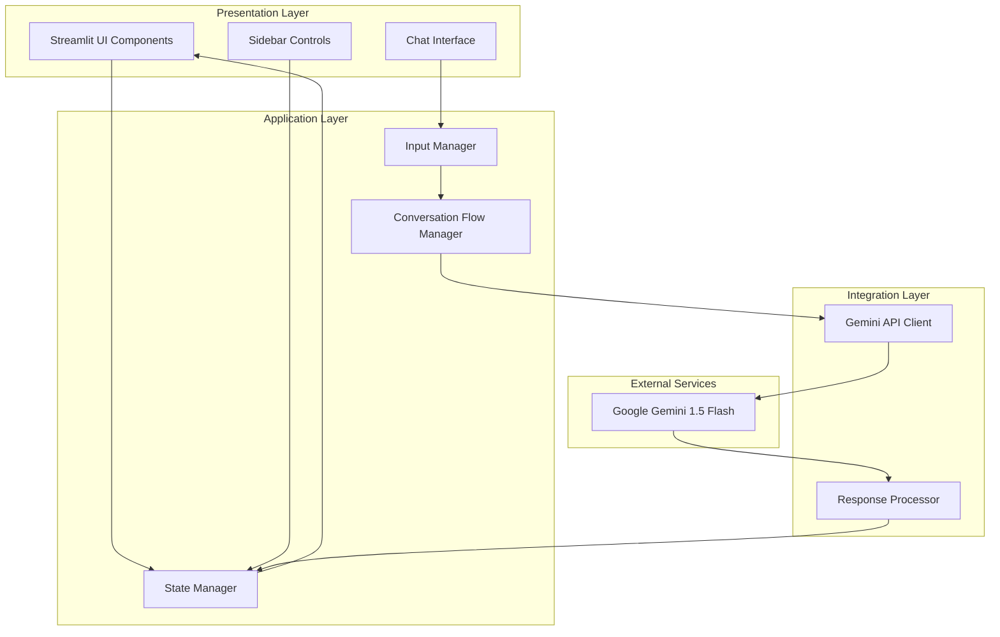
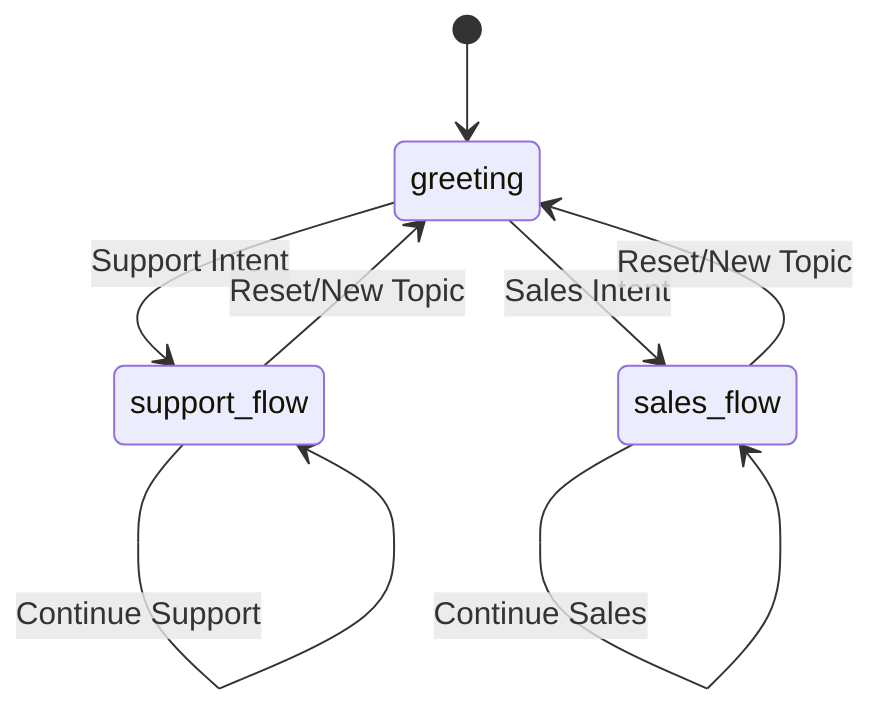

# Design Document: Sentinel Insurance Agent Stage 1

## Overview

Sentinel Stage 1 is a text-based conversational AI insurance agent built using Streamlit and Google Gemini LLM. The system provides a chat interface where users can interact with an AI agent for insurance-related queries and support. The design focuses on establishing a robust conversational foundation with proper state management, conversation flow handling, and integration with Google's Gemini 1.5 Flash model.

The architecture emphasizes simplicity and reliability for Stage 1, with clear separation between UI components, state management, and AI integration. This foundation will support future enhancements including voice capabilities, advanced insurance workflows, and multi-user support.

## Architecture

The system follows a layered architecture with clear separation of concerns:



**Key Architectural Principles:**
- **Single Responsibility**: Each component has a focused purpose
- **State Centralization**: All application state managed through Streamlit's session state
- **Loose Coupling**: Components interact through well-defined interfaces
- **Error Isolation**: Failures in one layer don't cascade to others

## Components and Interfaces

### 1. Chat Interface Component

**Purpose**: Renders the main conversation interface with message history and input controls.

**Key Methods**:
- `render_chat_history()`: Displays conversation messages with proper formatting
- `render_chat_input()`: Provides text input widget for user messages
- `format_message(role, content)`: Formats individual messages with role-based styling

**Interface Contract**:
```python
class ChatInterface:
    def render_chat_history(messages: List[Dict]) -> None
    def render_chat_input() -> Optional[str]
    def format_message(role: str, content: str) -> None
```

### 2. Sidebar Component

**Purpose**: Displays session information, statistics, and control buttons.

**Key Methods**:
- `render_session_stats(stats: SessionStats)`: Shows message count and user info
- `render_conversation_state(state: str)`: Displays current conversation flow state
- `render_clear_button()`: Provides conversation reset functionality

**Interface Contract**:
```python
class SidebarComponent:
    def render_session_stats(stats: SessionStats) -> None
    def render_conversation_state(state: str) -> None
    def render_clear_button() -> bool
```

### 3. State Manager

**Purpose**: Centralizes all application state management using Streamlit's session state.

**Key Methods**:
- `initialize_state()`: Sets up initial application state
- `add_message(role, content)`: Adds new message to conversation history
- `update_conversation_state(new_state)`: Changes conversation flow state
- `clear_conversation()`: Resets all conversation data
- `get_session_stats()`: Returns current session statistics

**State Schema**:
```python
SessionState = {
    'messages': List[Dict[str, str]],  # [{'role': 'user|assistant', 'content': str}]
    'conversation_state': str,         # 'greeting|support_flow|sales_flow'
    'message_count': int,
    'user_info': Dict[str, Any],       # Collected user information
    'initialized': bool                # Session initialization flag (not persistent)
}
```

### 4. Conversation Flow Manager

**Purpose**: Manages conversation state transitions and context awareness.

**Key Methods**:
- `determine_next_state(current_state, user_input)`: Analyzes input to determine state transitions
- `get_system_prompt(state)`: Returns appropriate system prompt for current state
- `should_collect_info(state, user_input)`: Determines if user information should be extracted

**State Transitions**:


### 5. Gemini API Client

**Purpose**: Handles all interactions with Google Gemini LLM, including conversation context management.

**Key Methods**:
- `initialize_client(api_key)`: Sets up Gemini client with authentication
- `generate_response(messages, system_prompt)`: Sends conversation to Gemini and gets response
- `handle_api_error(error)`: Processes API errors and provides fallback responses

**Configuration**:
- Model: `gemini-2.5-flash-lite` (free tier)
- Temperature: 0.7 (balanced creativity/consistency)
- Max tokens: 1024 (sufficient for insurance responses)
- Safety settings: Default (appropriate for insurance domain)

### 6. Input Manager

**Purpose**: Processes and validates user input before sending to conversation flow.

**Key Methods**:
- `validate_input(text)`: Ensures input meets basic requirements
- `sanitize_input(text)`: Cleans input for safe processing
- `extract_intent(text)`: Basic intent detection for flow routing

## Data Models

### Message Model
```python
@dataclass
class Message:
    role: str          # 'user' or 'assistant'
    content: str       # Message text content
    timestamp: datetime # When message was created
    metadata: Dict     # Additional message metadata
```

### Session Statistics Model
```python
@dataclass
class SessionStats:
    message_count: int
    conversation_duration: timedelta
    user_info_collected: Dict[str, Any]
    current_state: str
    last_activity: datetime
```

### Conversation State Model
```python
class ConversationState(Enum):
    GREETING = "greeting"
    SUPPORT_FLOW = "support_flow"
    SALES_FLOW = "sales_flow"
    ERROR_HANDLING = "error_handling"
```

### User Information Model
```python
@dataclass
class UserInfo:
    name: Optional[str] = None
    policy_number: Optional[str] = None
    contact_info: Optional[str] = None
    inquiry_type: Optional[str] = None
    collected_fields: Set[str] = field(default_factory=set)
```

## Correctness Properties

*A property is a characteristic or behavior that should hold true across all valid executions of a system—essentially, a formal statement about what the system should do. Properties serve as the bridge between human-readable specifications and machine-verifiable correctness guarantees.*

### Property 1: Message Display Consistency
*For any* conversation history containing messages from different roles (user/assistant), the chat interface should display user messages on the right and assistant messages on the left with visually distinct formatting.
**Validates: Requirements 1.1, 1.5**

### Property 2: Input Processing Completeness
*For any* valid user input, the system should capture the input, add it to conversation history, clear the input field, generate an AI response, and display the response in the conversation history.
**Validates: Requirements 2.1, 2.2, 2.5**

### Property 3: Empty Input Rejection
*For any* empty string or whitespace-only input, the system should prevent message submission and maintain the current conversation state unchanged.
**Validates: Requirements 2.4**

### Property 4: Session-Only State Management
*For any* conversation state (messages, statistics, conversation flow state, user info), the state should be maintained during the active browser session but reset to fresh state when the browser is refreshed or the application is restarted.
**Validates: Requirements 4.1, 4.2, 4.3, 4.4**

### Property 5: Conversation State Transitions
*For any* user input indicating specific intent (support or sales), the system should transition to the appropriate conversation state (support_flow or sales_flow) and display the updated state in the sidebar.
**Validates: Requirements 6.2, 6.4, 6.5**

### Property 6: Session Statistics Accuracy
*For any* conversation session, the displayed session statistics should accurately reflect the current message count, collected user information, and conversation state.
**Validates: Requirements 3.1, 3.2, 7.4, 7.5**

### Property 7: Conversation Reset Completeness
*For any* conversation state, when the Clear Conversation button is activated, the system should reset all conversation data, return to greeting state, and reinitialize with empty statistics.
**Validates: Requirements 3.4, 7.3**

### Property 8: AI Response Generation
*For any* user message in a conversation context, the Gemini LLM should generate a contextually appropriate response that maintains conversation continuity and handles insurance-specific queries appropriately.
**Validates: Requirements 5.1, 5.2, 5.3, 5.5**

### Property 9: Sidebar State Synchronization
*For any* change in conversation state or session statistics, the sidebar should automatically update to reflect the current state without manual refresh.
**Validates: Requirements 3.5, 6.3**

### Property 10: Error Handling Gracefully
*For any* system error (API unavailability, network issues, processing failures), the system should display appropriate error messages, maintain conversation state, and allow user retry without crashing.
**Validates: Requirements 8.1, 8.2, 8.3, 8.4**

### Property 11: Session-Only Continuity
*For any* conversation session, the system should maintain session continuity during the active browser session only, starting fresh when the browser is refreshed or the application is restarted.
**Validates: Requirements 7.2**

### Property 12: Privacy-Preserving Error Logging
*For any* error that occurs during operation, the system should log appropriate debugging information while ensuring no user conversation content or personal information is exposed in logs.
**Validates: Requirements 8.5**

## Error Handling

The system implements comprehensive error handling across all layers:

### API Integration Errors
- **Gemini API Unavailable**: Display user-friendly message "I'm temporarily unavailable. Please try again in a moment."
- **Rate Limiting**: Implement exponential backoff with user notification
- **Authentication Errors**: Log securely and display generic error message
- **Timeout Errors**: Retry with timeout escalation (5s, 10s, 15s)

### Input Validation Errors
- **Empty Input**: Silent rejection with no error message (UX best practice)
- **Malformed Input**: Sanitize and process or gracefully reject
- **Oversized Input**: Truncate with user notification
- **Special Characters**: Sanitize while preserving intent

### State Management Errors
- **Session State Corruption**: Reinitialize with clean state
- **Memory Overflow**: Implement conversation history limits (100 messages)
- **Concurrent Access**: Use Streamlit's built-in session isolation

### UI Rendering Errors
- **Component Failures**: Fallback to basic text display
- **Layout Issues**: Graceful degradation with core functionality preserved
- **Browser Compatibility**: Progressive enhancement approach

### Recovery Mechanisms
- **Automatic Retry**: For transient failures (network, API)
- **Manual Retry**: User-initiated retry for failed operations
- **Graceful Degradation**: Core functionality maintained during partial failures
- **State Preservation**: Conversation state maintained during error recovery

## Testing Strategy

The testing approach combines unit testing for specific behaviors with property-based testing for universal correctness guarantees.

### Unit Testing Approach
Unit tests focus on specific examples, edge cases, and integration points:

- **Component Integration**: Test Streamlit component rendering and interaction
- **API Integration**: Test Gemini API client with mock responses
- **State Transitions**: Test specific conversation flow transitions
- **Error Conditions**: Test specific error scenarios and recovery
- **UI Interactions**: Test button clicks, input submission, and display updates

### Property-Based Testing Approach
Property tests verify universal behaviors across all valid inputs using **Hypothesis** for Python:

- **Minimum 100 iterations** per property test to ensure comprehensive coverage
- **Random conversation generation** for testing display consistency
- **Random input generation** for testing input processing robustness
- **State mutation testing** for verifying persistence guarantees
- **Error injection testing** for validating error handling properties

### Test Configuration
Each property-based test will be tagged with comments referencing the design document:

```python
# Feature: sentinel-insurance-agent, Property 1: Message Display Consistency
def test_message_display_consistency(conversation_history):
    # Test implementation
```

### Testing Framework Setup
- **Unit Tests**: pytest with Streamlit testing utilities
- **Property Tests**: Hypothesis with custom generators for conversation data
- **Integration Tests**: Streamlit app testing with simulated user interactions
- **API Tests**: Mock Gemini API responses for reliable testing

### Coverage Requirements
- **Unit Test Coverage**: Focus on critical paths and error conditions
- **Property Test Coverage**: All 12 correctness properties must be implemented
- **Integration Coverage**: End-to-end conversation flows
- **Error Coverage**: All error handling paths and recovery mechanisms

The dual testing approach ensures both concrete correctness (unit tests) and universal behavior verification (property tests), providing comprehensive validation of the Sentinel insurance agent's functionality.